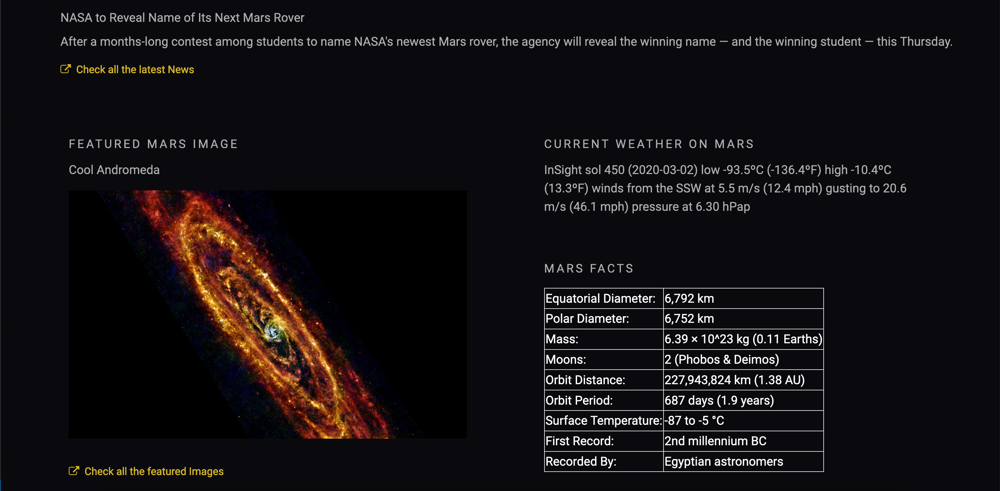
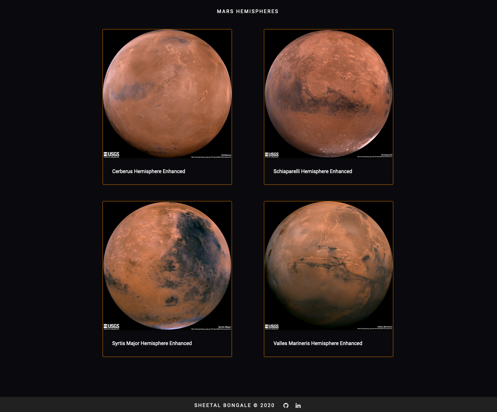

# Web Scraping - Mission to Mars

This challenge demonstrates to build a web application that scrapes various websites for data related to the Mission to Mars and displays the information in a single HTML page. 

The technologies used in this project are:

` BeautifulSoup | requests | Selenium | Splinter | MongoDB | Pandas `

Websites scraped:
- [NASA Mars News Site](https://mars.nasa.gov/news/) : Collect the latest News Title and Paragraph Text. 
- [JPL Featured Space Image](https://www.jpl.nasa.gov/spaceimages/?search=&category=Mars) : Find the image url for the current Featured Mars Image.
- [Mars Weather twitter account](https://twitter.com/marswxreport?lang=en) : Scrape the latest Mars weather tweet from the page.
- [ Mars Facts webpage](http://space-facts.com/mars/) : Scrape the table containing facts about the planet including Diameter, Mass, etc using Pandas.
- [ USGS Astrogeology site](https://astrogeology.usgs.gov/search/results?q=hemisphere+enhanced&k1=target&v1=Mars) : Obtain high resolution images for each of Mar's hemispheres.

This challenge is done in 2 steps:

## Step 1 - Scraping

Completed initial scraping using BeautifulSoup, Pandas, Requests, Selenium and Splinter.

## Step 2 - MongoDB and Flask Application

Use MongoDB with Flask templating to create a new HTML page that displays all of the information that was scraped from the URLs above.

* Created a route called `/scrape` that will import [scrape_mars.py](scrape_mars.py) script and call the `scrape` function.
* Store the return value in Mongo as a Python dictionary.
* Created a root route `/` that will query your Mongo database and pass the mars data into an HTML template to display the data.
* Created a template HTML file called [index.html](index.html) that will take the mars data dictionary and display all of the data in the appropriate HTML elements. 

